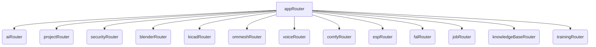

# Omnecor tRPC API Documentation

Omnecor utilizes tRPC as its primary API layer, providing a fully type-safe and efficient way for the frontend to communicate with the backend. This document outlines the structure, usage, and key features of the Omnecor tRPC API.

## 1. Overview

tRPC allows you to build end-to-end type-safe APIs without GraphQL or REST. It leverages TypeScript to infer types across the entire stack, from the backend server to the frontend client. All Omnecor tRPC endpoints are accessible under the `/api/trpc/` path.

### 1.1. Key Benefits

-   **End-to-End Type Safety**: Ensures that API requests and responses adhere to defined types, catching errors at compile time rather than runtime.
-   **Developer Experience**: Provides auto-completion and immediate feedback in the IDE, significantly improving development speed.
-   **No Code Generation**: Unlike GraphQL or OpenAPI, tRPC doesn't require separate code generation steps.
-   **Lightweight**: Minimal overhead, focusing on developer productivity.

## 2. API Structure

The Omnecor tRPC API is organized into a root `appRouter` (`server/routers/index.ts`) which aggregates various sub-routers. Each sub-router is responsible for a specific domain or feature area.



### 2.1. Routers

Each router (`server/routers/*.ts` and `server/phase2/routers/*.ts`) defines a set of procedures (queries, mutations, and subscriptions) related to its domain.

**Examples**:
-   `aiRouter.ts`: Procedures for interacting with AI models, managing providers, and inference.
-   `projectRouter.ts`: Procedures for managing projects, neural workspaces, and associated data.
-   `securityRouter.ts`: Procedures for authentication, authorization, and user management.
-   `blenderRouter.ts`: Procedures for interacting with the Blender bridge.

### 2.2. Procedures

tRPC procedures are the actual API endpoints. They can be:

-   **Queries**: For fetching data (read-only operations).
-   **Mutations**: For creating, updating, or deleting data (write operations).
-   **Subscriptions**: For real-time, event-driven data streams (used in conjunction with WebSockets).

Each procedure defines its input schema (using Zod for validation) and its output type, ensuring strict type adherence.

## 3. Usage from Frontend

On the frontend, `@trpc/react-query` is used to interact with the tRPC API. This provides React hooks for easily calling backend procedures, managing loading states, caching, and error handling.

### 3.1. Example: Fetching AI Models

```typescript
import { trpc } from "../lib/trpc";

function MyComponent() {
  const { data: models, isLoading, error } = trpc.ai.getModels.useQuery();

  if (isLoading) return <div>Loading AI models...</div>;
  if (error) return <div>Error: {error.message}</div>;

  return (
    <div>
      <h1>Available AI Models</h1>
      <ul>
        {models?.map((model) => (
          <li key={model.id}>{model.name} ({model.provider})</li>
        ))}
      </ul>
    </div>
  );
}
```

### 3.2. Example: Creating a Chat Session

```typescript
import { trpc } from "../lib/trpc";
import { useState } from "react";

function CreateChatSession() {
  const [title, setTitle] = useState("");
  const createSession = trpc.chat.createSession.useMutation();

  const handleSubmit = async () => {
    try {
      await createSession.mutateAsync({ title, providerId: "ollama", modelId: "llama2" });
      alert("Chat session created!");
      setTitle("");
    } catch (error) {
      alert("Error creating session: " + error.message);
    }
  };

  return (
    <div>
      <input
        type="text"
        value={title}
        onChange={(e) => setTitle(e.target.value)}
        placeholder="Session Title"
      />
      <button onClick={handleSubmit} disabled={createSession.isLoading}>
        {createSession.isLoading ? "Creating..." : "Create Session"}
      </button>
    </div>
  );
}
```

## 4. Context (`server/_core/context.ts`)

The `createContext` function is executed for every incoming request and provides access to various services and utilities that tRPC procedures might need. This is where singleton service instances (e.g., `SecurityService`, `VectorDBService`) are made available.

## 5. Error Handling

tRPC provides robust error handling. Errors thrown in backend procedures are automatically serialized and sent to the frontend, where `@trpc/react-query` handles them gracefully. Custom error types can be defined for more specific error messages.

## 6. Extensibility

Omnecor's tRPC API is designed to be extensible. Developers can easily add new routers and procedures to integrate new features or third-party modules, maintaining type safety across the entire application.
