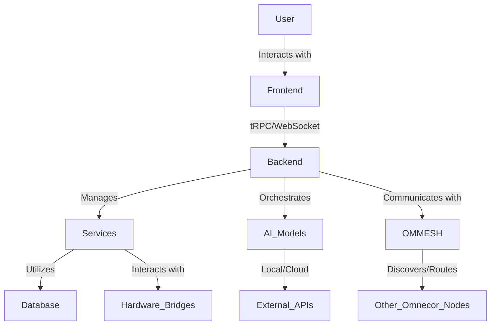

# Omnecor System Design

Omnecor is architected as a unified, local-first AI workstation, designed to provide a seamless and powerful environment for human-machine collaboration. The system's design prioritizes modularity, real-time synchronization, and extensibility.

## 1. High-Level Architecture

At its core, Omnecor operates as a single-process application, consolidating what would typically be disparate services into a cohesive unit. This approach simplifies deployment, enhances performance through reduced inter-process communication overhead, and ensures tight integration between components.

## 2. Core Components

### 2.1. Unified Backend

The backend is built on Express.js and tRPC, serving as the central nervous system of Omnecor. It handles all API requests, manages state, and orchestrates interactions between various services and external systems.

-   **Express.js**: Provides the web server foundation, handling HTTP requests and middleware.
-   **tRPC**: A type-safe API layer that enables seamless communication between the frontend and backend, ensuring end-to-end type safety.
-   **WebSocket Server**: Integrated into the same HTTP server, it provides real-time, bi-directional communication for features like Neural Node-Tree updates, training progress, and hardware bridge status.

### 2.2. Frontend Application

The user interface is a modern web application built with React and Vite, designed for responsiveness and an intuitive user experience.

-   **React**: A declarative JavaScript library for building user interfaces.
-   **Vite**: A fast build tool that provides a rapid development experience.
-   **shadcn/ui**: A collection of re-usable components built using Radix UI and Tailwind CSS, ensuring a consistent and accessible design system.
-   **React Flow**: Used for rendering the interactive Neural Workspaces, allowing users to visualize and manipulate project graphs.

### 2.3. Services Layer

Omnecor's functionality is encapsulated within a set of singleton services, initialized at application startup. These services manage specific domains and are accessible via the tRPC context.

Key services include:

-   **`SecurityService`**: Manages authentication, authorization, and cryptographic operations.
-   **`VectorDBService`**: Handles semantic indexing and retrieval for the knowledge base (using ChromaDB).
-   **`ProcessManagerService`**: Orchestrates and manages child processes, particularly for hardware bridges and external tool integrations.
-   **`MeshDiscoveryService`**: Part of OMMESH, responsible for discovering other Omnecor nodes on the network.
-   **`AiProviderService`**: Manages connections and routing to various local and cloud AI models.
-   **`FileSystemWatcherService`**: Monitors file system changes to trigger indexing or other automated workflows.

### 2.4. OMMESH (Distributed Mesh Intelligence Layer)

OMMESH is a critical subsystem enabling multi-node collaboration and distributed AI inference. It allows multiple Omnecor instances on a local network to form a secure mesh.

-   **DiscoveryService**: Utilizes Bonjour for local network service discovery.
-   **SecurityManager**: Ensures secure communication between nodes using mTLS.
-   **RoutingEngine**: Intelligently routes AI inference requests to available nodes based on factors like VRAM availability and model presence.

### 2.5. Hardware Integration Layer (Bridges)

Omnecor provides robust integration with specialized hardware and software tools through dedicated Python bridges, managed by the `ProcessManagerService`.

-   **Blender Bridge**: For 3D modeling and rendering tasks.
-   **KiCad Bridge**: For PCB design and engineering workflows.
-   **ESPTool Bridge**: For flashing firmware to ESP microcontrollers.

### 2.6. AI Systems

Omnecor supports a flexible AI ecosystem, integrating both local and cloud-based models.

-   **Model Hub**: Centralized management for configuring and connecting to various AI models (e.g., Ollama/Llama.cpp for local models, OpenAI, Anthropic, Gemini via API).
-   **Inference Routing**: Intelligent dispatching of AI tasks to the most suitable model based on performance, cost, and task requirements.
-   **Memory Layer**: Utilizes recursive directory chunking and ChromaDB for Retrieval-Augmented Generation (RAG), providing context-aware AI interactions.

## 3. Data Flow and Persistence

Omnecor emphasizes local data sovereignty. Most data is stored directly on the user's machine.

-   **Database**: Drizzle ORM is used for database interactions, with schema defined in `drizzle/schema.ts`. It supports MySQL/TiDB.
-   **File System**: Project assets, configurations, and AI-generated outputs are stored on the local file system.
-   **Context Management**: The `ContextManagerService` ensures that AI agents maintain context across sessions and tasks, leveraging the VectorDB for semantic memory.

## 4. Communication Protocols

-   **HTTP/HTTPS**: For standard web requests and API interactions.
-   **WebSockets**: For real-time updates, streaming data, and interactive UI components.
-   **mTLS**: For secure, authenticated communication within the OMMESH network.
-   **Inter-Process Communication (IPC)**: For communication between the Node.js backend and Python-based hardware bridges.
