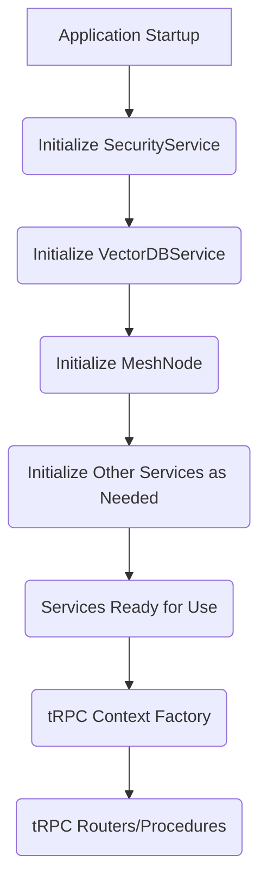

# Omnecor Backend Services Overview

Omnecor's backend functionality is modularized into a set of singleton services, each responsible for a specific domain or set of operations. These services are initialized at application startup and are made available to tRPC routers and other parts of the backend through a shared context. This design promotes separation of concerns, reusability, and testability.

## 1. Service Initialization and Lifecycle

Services are typically initialized in `server/_core/index.ts` during the application bootstrap phase. They are designed as singletons, meaning only one instance of each service exists throughout the application's lifetime. This ensures consistent state and resource management.

## 2. Core Services

### 2.1. `SecurityService` (`server/phase2/services/SecurityService.ts`)

-   **Purpose**: Manages all security-related aspects of the application, including authentication, authorization, and cryptographic operations.
-   **Key Responsibilities**:
    -   Handling user authentication flows (e.g., via OAuth).
    -   Managing user sessions and permissions.
    -   Enforcing access control policies.
    -   Performing data encryption (e.g., AES-256-GCM for sensitive local data).
    -   Protecting against common web vulnerabilities like CSRF and path traversal.

### 2.2. `VectorDBService` (`server/phase2/services/VectorDBService.ts`)

-   **Purpose**: Implements the knowledge base functionality, responsible for semantic indexing and retrieval of project data.
-   **Key Responsibilities**:
    -   Initializing and managing the ChromaDB instance.
    -   Processing documents and files through recursive chunking.
    -   Generating and storing vector embeddings of text chunks.
    -   Performing semantic search and retrieval for Retrieval-Augmented Generation (RAG).
    -   Graceful degradation if the vector database cannot be initialized.

### 2.3. `ProcessManagerService` (`server/phase2/services/ProcessManagerService.ts`)

-   **Purpose**: Orchestrates and monitors external child processes, primarily for integrating with Python-based hardware bridges and other external tools.
-   **Key Responsibilities**:
    -   Spawning and managing child processes (e.g., for Blender, KiCad, ESPTool bridges).
    -   Monitoring the health and status of external processes.
    -   Streaming output (e.g., logs, progress updates) from child processes back to the backend.
    -   Ensuring graceful shutdown of all managed processes during application termination.

### 2.4. `MeshDiscoveryService` (`server/ommesh/core/DiscoveryService.ts`)

-   **Purpose**: Part of the OMMESH distributed mesh intelligence layer, responsible for discovering and managing other Omnecor nodes on the local network.
-   **Key Responsibilities**:
    -   Utilizing Bonjour for zero-configuration service discovery.
    -   Maintaining a registry of active Omnecor nodes in the mesh.
    -   Facilitating secure communication setup between nodes.

### 2.5. `AiProviderService` (`server/phase2/services/AiProviderService.ts`)

-   **Purpose**: Manages connections to various local and cloud AI models and intelligently routes inference requests.
-   **Key Responsibilities**:
    -   Configuring and connecting to local AI inference servers (e.g., Ollama/Llama.cpp).
    -   Integrating with cloud AI APIs (e.g., OpenAI, Anthropic, Gemini, Fal.ai).
    -   Implementing logic for intelligent inference routing based on task, cost, and resource availability.
    -   Handling model loading and unloading.

### 2.6. `FileSystemWatcherService` (`server/phase2/services/FileSystemWatcherService.ts`)

-   **Purpose**: Monitors specified directories for file system changes, triggering automated workflows like re-indexing or data processing.
-   **Key Responsibilities**:
    -   Setting up watch events on configured directories.
    -   Detecting file creation, modification, and deletion events.
    -   Notifying other services (e.g., `VectorDBService`) about relevant changes.

### 2.7. `MemoryArchitectService` (`server/phase2/services/MemoryArchitectService.ts`)

-   **Purpose**: Manages the AI context and memory layers, leveraging the `VectorDBService` to provide Retrieval-Augmented Generation (RAG) capabilities.
-   **Key Responsibilities**:
    -   Orchestrating the creation and retrieval of AI memory.
    -   Providing contextual information to AI models based on semantic search.
    -   Ensuring persistent storage and retrieval of AI context across sessions.

### 2.8. `HITLApprovalService` (`server/phase2/services/HITLApprovalService.ts`)

-   **Purpose**: Integrates Human-In-The-Loop (HITL) approval workflows into AI-driven tasks.
-   **Key Responsibilities**:
    -   Pausing AI workflows at critical junctures for human review.
    -   Managing approval requests and decisions.
    -   Resuming workflows based on human input.

### 2.9. `HashTrackerService` (`server/phase2/services/HashTrackerService.ts`)

-   **Purpose**: Tracks content hashes for data integrity, change detection, and efficient caching.
-   **Key Responsibilities**:
    -   Calculating and storing hashes of files or data chunks.
    -   Detecting changes in content by comparing hashes.
    -   Optimizing operations by avoiding reprocessing unchanged data.

## 3. Service Interaction

Services primarily interact with each other by calling methods on their singleton instances. This allows for a clean, dependency-injected architecture where services can collaborate to fulfill complex requests. The tRPC context factory (`server/_core/context.ts`) plays a crucial role in making these service instances available to every tRPC procedure.
