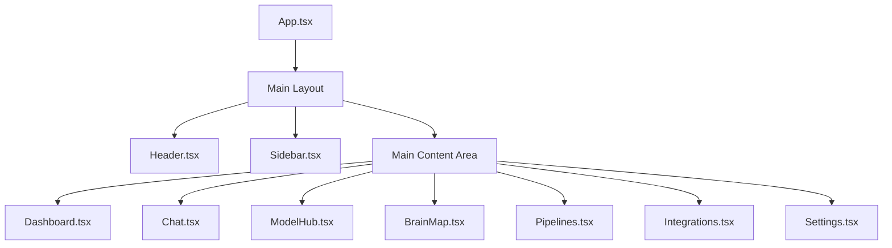

# Omnecor Frontend Component Hierarchy

Omnecor's frontend is built using React, organized into a modular component hierarchy to promote reusability, maintainability, and scalability. This document outlines the main component categories and their relationships.

## 1. Top-Level Application Structure

The application's entry point is typically `client/src/App.tsx`, which orchestrates the main layout and routing. The `client/src/pages/` directory contains the top-level views for different sections of the application.

## 2. Component Categories

Omnecor's components are broadly categorized based on their functionality and reusability:

### 2.1. UI Primitives (`client/src/components/ui/`)

This directory contains highly reusable, atomic UI components built using `shadcn/ui` (which leverages Radix UI and Tailwind CSS). These components form the visual building blocks of the application.

**Examples**:
-   `button.tsx`: Standard button component.
-   `input.tsx`: Input fields.
-   `card.tsx`: Generic card container.
-   `dialog.tsx`: Modal dialogs.
-   `dropdown-menu.tsx`: Dropdown menus.
-   `tooltip.tsx`: Tooltips for interactive elements.
-   `accordion.tsx`, `tabs.tsx`, `switch.tsx`, `slider.tsx`, `checkbox.tsx`, etc.

### 2.2. Core Application Components (`client/src/components/`)

These are higher-level components that compose UI primitives to form specific parts of the application interface.

**Examples**:
-   `Header.tsx`: The application header, often containing navigation, search, and user controls.
-   `Sidebar.tsx`: The main navigation sidebar.
-   `CommandPalette.tsx`: A global command palette for quick actions.
-   `FloatingWindow.tsx`: Manages detachable, floating UI panels.

### 2.3. Feature-Specific Components

These components are tailored to specific features or modules of Omnecor and reside in subdirectories within `client/src/components/`.

-   **`client/src/components/chat/`**:
    -   `ChatPanel.tsx`: The main chat interface component.
    -   `ChatInput.tsx`: Input area for sending messages.
    -   `MessageDisplay.tsx`: Renders individual chat messages.

-   **`client/src/components/model-hub/`**:
    -   `ModelCard.tsx`: Displays information about an AI model.
    -   `ModelConfigForm.tsx`: Form for configuring model settings.

-   **`client/src/components/neural/`**:
    -   `NeuralGraphView.tsx`: The core component for rendering the interactive Neural Brain Map (uses React Flow).
    -   `NeuralTreeView.tsx`: Alternative tree-based view of neural nodes.
    -   `MapManager.tsx`: Manages the state and interactions within the Neural Brain Map.

-   **`client/src/components/workspace/`**:
    -   `NeuralWorkspaceCanvas.tsx`: The canvas for the neural workspace.
    -   `nodes/FileNode.tsx`: Represents a file within the neural graph.

-   **`client/src/components/media/`**:
    -   `ComfyPanel.tsx`: UI for ComfyUI integration.
    -   `ImageStudioPanel.tsx`: UI for image generation/editing.

-   **`client/src/components/voice/`**:
    -   `TTSPanel.tsx`: UI for Text-to-Speech functionality.
    -   `VoiceInputButton.tsx`: Component for voice input.

### 2.4. Pages (`client/src/pages/`)

These components represent the main views or 
screens of the application. They typically compose multiple feature-specific components and core UI components to form a complete user interface for a particular section.

**Examples**:
-   `Dashboard.tsx`: The main landing page after login.
-   `Chat.tsx`: The full chat interface page.
-   `BrainMap.tsx`: The page displaying the Neural Brain Map.
-   `Settings.tsx`: The page for application settings.

## 3. Component Interaction and Data Flow

Components primarily interact through React props for parent-child communication and context APIs (e.g., `NeuralMapContext.tsx`, `ThemeContext.tsx`) for global state management. Data fetching and mutations are handled via tRPC hooks (`@trpc/react-query`), ensuring type-safe communication with the backend.

## 4. Hooks (`client/src/hooks/`)

Custom React hooks are used to encapsulate reusable logic and stateful behavior, promoting cleaner and more maintainable components.

**Examples**:
-   `useOmnecorSocket.ts`: Manages WebSocket connections and real-time data.
-   `useComposition.ts`: Handles text composition input.
-   `useMobile.tsx`: Detects mobile environments for responsive adjustments.

## 5. Utilities and Stores (`client/src/lib/`)

This directory contains various utility functions, helper modules, and Zustand stores for client-side state management.

**Examples**:
-   `aiModels.ts`: Logic for managing AI models.
-   `chatContext.ts`: Manages chat-related context.
-   `contextManager.ts`: General context management utilities.
-   `stores/brainMapStore.ts`: Zustand store for Neural Brain Map state.
-   `utils.ts`: General utility functions.
