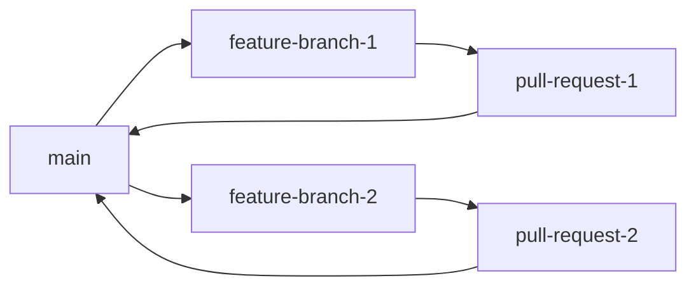

# Omnecor Development Workflows

This document outlines the standard development workflows for contributing to the Omnecor project. Adhering to these guidelines ensures consistency, facilitates collaboration, and maintains the quality of the codebase.

## 1. Local Development Setup

Before starting any development, ensure your local environment is set up correctly as described in the [Installation Guide](INSTALL.md) and [Contributing Guide](CONTRIBUTING.md).

### 1.1. Starting the Development Server

To run Omnecor in development mode, which includes live reloading for both frontend and backend changes:

```bash
npm run dev
```

This command will:
-   Start the Vite development server for the frontend.
-   Start the `tsx watch` server for the backend, automatically restarting on file changes.
-   Make the application accessible, typically at `http://localhost:3000/`.

### 1.2. Database Migrations

If you make changes to the Drizzle ORM schema (`drizzle/schema.ts`), you need to generate and apply migrations:

1.  **Generate Migration**: This command creates a new migration file based on the changes in your schema.
    ```bash
    pnpm drizzle-kit generate
    ```
2.  **Apply Migration**: This command applies the pending migrations to your local database.
    ```bash
    pnpm run db:push
    ```

## 2. Git Branching Strategy

Omnecor follows a feature-branch workflow. All development work for new features or bug fixes should occur in dedicated branches.



### 2.1. Branch Naming Conventions

-   **Features**: `feature/<descriptive-name>` (e.g., `feature/add-model-hub`)
-   **Bug Fixes**: `bugfix/<descriptive-name>` (e.g., `bugfix/fix-chat-scroll`)
-   **Hotfixes**: `hotfix/<descriptive-name>` (for urgent fixes directly to `main`)
-   **Documentation**: `docs/<descriptive-name>` (e.g., `docs/update-install-guide`)

### 2.2. Workflow Steps

1.  **Pull Latest `main`**: Always start by ensuring your local `main` branch is up-to-date.
    ```bash
    git checkout main
    git pull origin main
    ```
2.  **Create a New Branch**: Create a new branch from `main` for your work.
    ```bash
    git checkout -b feature/my-new-feature
    ```
3.  **Develop and Commit**: Make your changes, committing frequently with clear and concise messages.
    ```bash
    git add .
    git commit -m 
"`feat: Add new feature for model hub`"
    ```
4.  **Push Your Branch**: Push your local branch to the remote repository.
    ```bash
    git push origin feature/my-new-feature
    ```
5.  **Create a Pull Request (PR)**: Open a Pull Request on GitHub from your feature branch to the `main` branch. Ensure your PR description is clear and concise, explaining the changes and their purpose.
6.  **Code Review**: Your PR will be reviewed by other contributors. Address any feedback or requested changes.
7.  **Merge**: Once approved, your PR will be merged into the `main` branch.

## 3. Code Style and Formatting

Omnecor enforces a consistent code style using `prettier`. Before committing your changes or creating a pull request, ensure your code is formatted correctly:

```bash
pnpm run format
```

This command will automatically format all code files in the project.

## 4. Testing

All new features and bug fixes should be accompanied by appropriate tests. Omnecor uses `vitest` for its testing framework.

### 4.1. Running Tests

To run all tests:

```bash
pnpm run test
```

### 4.2. Writing Tests

-   **Unit Tests**: For individual functions, components, or services.
-   **Integration Tests**: For verifying the interaction between multiple components or services.

Ensure your tests cover the new functionality and that all existing tests pass after your changes.

## 5. Documentation Requirements

Any significant changes to features, APIs, or architecture must be reflected in the project documentation. This includes:

-   Updating the `README.md` for major feature additions.
-   Modifying relevant files in the `docs/` directory.
-   Updating the `CHANGELOG.md` with a summary of your changes.

## 6. Issue Triage

If you are involved in triaging issues, please follow these guidelines:

-   **Reproduce**: Attempt to reproduce the reported bug.
-   **Clarify**: Ask for more information if the issue description is unclear.
-   **Label**: Apply appropriate labels (e.g., `bug`, `feature`, `enhancement`, `documentation`).
-   **Prioritize**: Help prioritize issues based on severity and impact.
-   **Close Duplicates**: Close duplicate issues and link to the original.

## 7. Release Workflows

Release management is handled by project maintainers. The `main` branch is considered stable, and releases are typically tagged from `main` after thorough testing. For more details on release procedures, refer to `RELEASE_WORKFLOWS.md` (if available).
